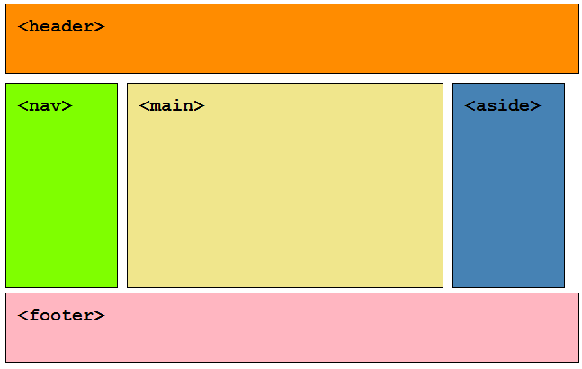

# Mini-Project 2: HTML Head Checklist

Trang web hướng dẫn chi tiết về cách cấu hình các thành phần trong thẻ `<head>` của HTML đạt chuẩn SEO và Responsive, kèm theo các quy tắc viết code sạch (bình luận, thụt dòng).

🔗 **Link GitHub Pages:** https://trunqnghia.github.io/htmlmini

---

## 🖼️ 1. Ảnh chụp thiết kế UI (UI Design)
Dưới đây là bản phác thảo thiết kế giao diện trước khi lập trình:

---

## 📐 2. Mô tả phân vùng HTML theo thiết kế
Dựa trên ảnh thiết kế UI, cấu trúc tệp `index.html` được phân chia thành 4 khu vực chính:

1. **Khối `<head>`**: Chứa đầy đủ các thẻ meta (charset, viewport), tiêu đề và liên kết tài nguyên ngoài (CSS/JS).
2. **Vùng `<header>`**: Chứa tiêu đề chính của trang web và phần giới thiệu ngắn.
3. **Vùng `<main>` (Danh sách Checklist)**: Được chia nhỏ thành các thẻ `<section>` chứa thẻ bài viết `<article>` cho từng tiêu chí (Charset, Viewport, Title, Link CSS, Script JS, Comments, Indentation).
4. **Vùng `<footer>`**: Chứa thông tin bản quyền và tác giả.

---

## 🛠️ 3. Cấu trúc mã nguồn trong Repo
- `assets/ui-design.png`: Ảnh thiết kế UI toàn trang.
- `css/style.css`: Quy định màu sắc, bố cục và hiệu ứng hiển thị.
- `js/script.js`: Xử lý tính năng tích chọn (Check/Uncheck) tương tác cho danh sách.
